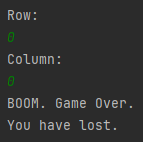
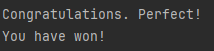

## MineSweeper Oyunu

Bu Java programı, belli bir düzen içerisinde oluşturulmuş alanda rastgele yerleştirilmiş mayınlardan kaçınmaya dayanmaktadır. Oyun, kullanıcıların yerleştirilen mayınları seçmeyerek alanı temizlemeye çalıştığı basit bir mantık oyunudur.

### Oynanış

Oyun başladığında, kullanıcıya default 5'e 5 bir alan sunulur veya kullanıcı alanı, MineSweeper parametrelerini kullanarak değiştirebilir. 

#### `MineSweeper start = new MineSweeper(5,5);`

Kullanıcı mayınları belirleyip işaretleyerek alanı temizlemeye çalışır.

`Row: ` (input)

`Column: ` (input)

- Kullanıcı, koordinatlarını girdikten sonra, o alandaki mayınlarını kontrol eder ve her adımda bir alanı temizler.
- Mayına dokunulduğunda veya oyun alanının 4'te 3'ü temizlendiğinde oyun biter.

### Kaybetme Senaryosu

### Kazanma Senaryosu

## Metod Açıklamaları

### `public MineSweeper(int row, int column)`

- MineSweeper sınıfının yapıcı metodudur.
- **Parametreler:**
    - `row`: Oyun alanındaki satır sayısı.
    - `column`: Oyun alanındaki sütun sayısı.
- Belirtilen satır ve sütun sayısına göre MineSweeper oyununu başlatır. Mayın alanı ve kullanıcı alanı dizilerini buna göre ayarlar.

### `public void administrator(String[][] field)`

-  Oyun alanının yönetici görünümünü gösteren metod.
- **Parametreler:**
    - `field`: Oyun alanını temsil eden 2 boyutlu dizi.
-  Oyun alanını dolaşır ve her hücreyi gösterir.

### `public void playerMap(int rowInput, int colInput)`

-  Oyun alanının kullanıcının görünümünü gösteren metod.
- **Parametreler:**
    - `rowInput`: Kullanıcının girdiği satır endeksi.
    - `colInput`: Kullanıcının girdiği sütun endeksi.
-  Oyun alanının kullanıcının görünümünü gösterir. Belirtilen hücre daha önce açılmışsa, komşu mayınların sayısını gösterir. Aksi takdirde bir tire (`-`) görüntüler.

### `public void mineAdder()`

-  Oyun alanına rastgele mayın yerleştiren metod.
-  Oyun alanındaki hücreleri rastgele seçer ve belirtilen mayın sayısına ulaşılana kadar mayın (`*`) yerleştirir. Mayınların aynı hücreye birden fazla kez yerleştirilmesini engeller.

### `public void gamePlay()`

-  MineSweeper oyununun oyun mantığını işleyen metod.
-  Oyunun akışını yönetir, yönetici görünümünü gösterir, kullanıcı görünümünü başlatır, kullanıcı girişlerini kabul eder ve kullanıcı girişlerine göre oyun durumunu günceller. Oyun, oyuncu bir mayına dokunana veya tüm mayın olmayan hücreler temizleneceğine kadar devam eder.

### `public void gameMechanics(int rowInput, int colInput)`

-  Hücreleri açma ve komşu mayınları sayma oyun mekaniğini işleyen metod.
- **Parametreler:**
    - `rowInput`: Kullanıcının girdiği satır endeksi.
    - `colInput`: Kullanıcının girdiği sütun endeksi.
-  Belirtilen hücrenin komşu hücrelerini kontrol ederek, etrafındaki mayın sayısını belirler. Komşu mayın yoksa kullanıcı alanını komşu mayınların sayısı ile günceller veya hücreyi açar.

